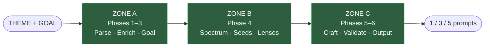

# UPG — Universal Prompt Generator

A prompt-engineering system for text-to-image models. Takes a theme, returns a calibrated spectrum of 1–5 executable prompts, with safety, drift, and cliché enforcement built into the pipeline.


> 🇷🇺 [Читать на русском](README.ru.md)

**Quick links:** 🎯 [About](#-what-is-this) · 🚀 [Usage](#-usage) · 🏛️ [Architecture](docs/ARCHITECTURE.md) · 🧪 [Benchmark](BENCHMARK.md) · 📜 [CHANGELOG](CHANGELOG.md) · 📚 [Glossary](docs/GLOSSARY.md)

---

## 🎯 What is this?

**UPG** (Universal Prompt Generator) is a large system prompt that you paste into ChatGPT, Claude, or any capable reasoning model. You give it a theme (a word, a phrase, a structured template). It returns 1, 3, or 5 production-ready prompts for Midjourney, Flux, Stable Diffusion, xAI Aurora, Gemini Imagen, or Firefly.

What separates UPG from a one-shot prompt template:

- **Six-phase pipeline** with explicit validation gates at each boundary.
- **Safety transform layer** — identifiable people, trademarked IP, graphic violence, hate speech get remapped at Phase 1.3 and the replacements propagate into every downstream output.
- **Theme-width aware enrichment** — broad umbrella themes ("eco-packaging", "love") are never narrowed into a single ideological slice; specific variants are generated explicitly as side branches.
- **EIS-based drift control** — emotional intensity of each slot is measured numerically and kept within defined tolerances of the original theme.
- **BAN REGISTRY** — a canonical list of banned adjectives ("soft", "subtle", "elegant"), abstract nouns ("essence", "harmony"), and final-sentence patterns that would dilute any prompt into stock-photo mush.
- **Slot system S1–S5** — each slot fills a defined role (anchor / contrast / adjacent / oblique / absence), with a Ring Test preventing S4 from collapsing back into S1.
- **Eight Creative Lenses** — PHOTO, CINE, TEXTURAL, PAINT, ENV, SYMBOLIC, MINIMAL, SENSORY — with compatibility checks against aspect ratio and subject visibility.

The current version is **v10** and occupies roughly 30 KB of compressed notation. The earliest concept (v0) was a 5-step Russian "cliché breaker" for commercial campaigns. The first numbered release (v1.0) from March 2026 was an 11-step Russian greeting-card generator. Between v0 and v10 sit 39 iterations and 23 patches.

---

## 📖 Why this repo exists

This is a **personal research archive**. The goal is not distribution — it is documentation. Every full version is preserved so the design decisions can be traced:

- How did error handling for "abstract-hard" themes emerge? See v5.4 → v6.0 → v7.2.
- When did ZONE A/B/C appear and why? See v7.2.
- Why was v9.15 so much shorter than v9.14? See the compression shift (ban registry becomes canonical).
- What problem does the Ring Test solve? See Checklist BLOCK F3.

Read the code of a prompt system, not just its current frontend. That's the point.

---

## ⚙️ Pipeline at a glance



**Phase 1** parses raw input, classifies theme width, runs safety checks, routes to SIMPLE (1 prompt) / STANDARD (3) / COMPLEX (5). **Phase 2** enriches within bounds defined by theme width and intent signal. **Phase 3** derives an AUTO-GOAL if the user didn't supply one. **Phase 4** generates the spectrum: seeds, slot assignments, lens distribution, entry-angle rotation. **Phase 5** crafts the actual prompt prose with the ban registry active. **Phase 6** runs validation layers L1–L9.2 before emitting the final output.

---

## 📁 Repo layout

```
upg/
├── full_versions/     39 snapshots — from the v0 concept through v10 (+ parallel v666 branch)
├── patches/           23 incremental patch notes
├── project_tools/     Companion protocols: Checklist, Analysis, VCP, Tournament, Dashboard
├── tools/             Visual Correspondence Protocol + a worked example
├── scripts/           build_vault.py — regenerates the author's Obsidian vault
├── docs/              ARCHITECTURE, USAGE, EVOLUTION, GLOSSARY
├── LICENSE            All rights reserved
├── CHANGELOG.md       Keep-a-Changelog format, grouped by major
└── README.md          ← you are here
```

---

## 📜 Versions at a glance

| Era | Versions | What changed |
|---|---|---|
| **0.x (concept)** | v0 | 5-step Russian concept: _cliché analysis → pattern-breaking → "artistic DNA" enhancement → structured prompt → self-scoring_. Already contains a slotted output (`[Subject] [Environment] [Lighting]...`) and 6-criterion self-scoring — the ancestors of slots S1–S5 and EIS. Theme is hardcoded into the prompt itself (example — `Spring Energy`, sportswear, commercial). |
| **1.x** | v1.0 | 11-step Russian greeting-card generator. Name "Universal" is aspirational, not literal. |
| **2–3** | v2.0, v2.2, v2.3, v3.0, v3.3, v3.5 | English pivot. True universal intent. v3.x adds Associative Artifacts + scratchpad CoT. |
| **4–5** | v4.0 → v5.6 | Parallel Image Prompt Generator branch. v5.1 is a meta-critic / surgeon tool, not a generator. v5.4 introduces INTENT_SIGNAL, ABSTRACT-HARD flag, full safety taxonomy with propagation locks. |
| **6** | v6.0 → v6.6 | GLOBAL PRIORITY STACK, EIS 0–100 scale, 5-Gate Boundary, Pattern 3C for abstract-hard themes. |
| **7–8** | v7.2 → v8.9 | ZONE A/B/C refactor. CONCISE_MODE becomes default. Eight Creative Lenses stabilize. |
| **9** | v9.4 → v9.19.1 | Compression era. v9.15 makes BAN REGISTRY canonical. v9.18 adds CAMERA_SYSTEM (ARRI/RED/Sony/Hasselblad lens tables), THRESHOLD_ELEMENTS, REALISM_ANCHOR, REFERENCE_EXTRACTION. |
| **10** | v10 | Generator Trigger Registry, six locks (IDENTITY / LOCALE / STYLE / MATERIAL / AUTH / DEVICE_SIM), VALIDATION STACK L1–L9.2, HARD CHECKS P0–P1M. |
| **666** | v666.4.1, v666.5.2.1, v666.5.2.3 | Parallel fork with accumulated rules in a separate line of development. |

See [CHANGELOG.md](CHANGELOG.md) for the full per-version record and [docs/EVOLUTION.md](docs/EVOLUTION.md) for the branching story (it is not a linear chain).

---

## 🛠️ Companion tools

UPG is the engine. These are the protocols that surround it.

| Tool | Version | What it does |
|---|---|---|
| **Checklist** | v1.8.0 | Interview-first theme-authoring spec. Runs in a separate session, produces a THEME TEMPLATE that UPG v9.15+ consumes as STRUCTURED THEME INPUT. 21 blocks, 80 parameters, criticality markers. |
| **Analysis Prompt** | v1.1 | 10-stage post-run analysis protocol. Classifies compression artifacts, drift, unauthorized injection. |
| **Audit Analysis** | v1.2 | Second-pass audit for routing and safety integrity. |
| **Analysis Report** | v2.1 | Structured output format for the analysis pipeline. |
| **Visual Correspondence Protocol (VCP)** | v1.0 | 6-stage image ↔ prompt audit. Scores fidelity, identifies missing elements, flags unauthorized additions. |
| **Session Dashboard** | v1.0 | 9-block session summary for cross-session handoff. |
| **Tournament** | v2 | Comparative ranking of prompt variants. |

All companion tools live in [`project_tools/`](project_tools/) and [`tools/`](tools/).

---

## 🧪 Testing and benchmark

UPG has been run through a validation campaign: **32 tests across 18 LLMs** (OpenAI, Anthropic, Google, Zhipu, Moonshot, Baidu, Alibaba, xAI, DeepSeek). Full report (in Russian, with emoji vendor markers): [BENCHMARK.md](BENCHMARK.md).

**Top by reliability (best of 29/29):**

| Rank | Model | Score | Tier |
|---|---|---|---|
| 🥇 | 🐸 GPT-5.4 / 5.2 👑 | 29/29 | S+ Premium |
| 🥈 | 🇨🇳 GLM-5 | 28/29 | S Premium |
| 🥉 | 🦊 Sonnet-4.5 | 27.5/29 | A+ High |
| — | 🦚 Gemini-3.1 | 28.5/29 | S+ Premium |

Models with known drift (Claude line, DeepSeek, Grok, ERNIE, Qwen) get compensating wrapper blocks. GPT-5.4 / 5.2 / Gemini-3.1 / GLM-5 run UPG clean without wrappers.

The v12.1 campaign audit surfaced two validation blind spots (L7 density counting, L7.5 lens-aspect compat), both closed in patch v9.22 and inherited by v10.

---

## 🚀 Usage

The full walkthrough is in [docs/USAGE.md](docs/USAGE.md). In short:

1. Open [full_versions/UPG_v10.md](full_versions/UPG_v10.md). Copy the entire file.
2. Paste as a system prompt (Claude Projects) or as the first message (ChatGPT custom GPT, or plain chat).
3. Give it your theme. Minimum: `THEME: red running shoes in rain`. With the Checklist run separately, provide the generated STRUCTURED THEME INPUT block instead.
4. Read the output, copy any of the 1/3/5 prompts into your image model.

For deeper workflows — Checklist → UPG session handoff, Tournament ranking, Visual Correspondence audit — see the USAGE doc.

---

## 🏛️ Architecture

The 30-minute read for anyone who wants to understand the design is [docs/ARCHITECTURE.md](docs/ARCHITECTURE.md). It covers phases, zones, seeds, modules, the ban registry, and why each validation layer exists.

For terminology (EIS, Drift, Ring Test, Carrying Image, Lens, Zone, Slot) see [docs/GLOSSARY.md](docs/GLOSSARY.md).

---

## 📊 Status

Active research. Numbering is author-defined (no semantic-versioning guarantee). Patches can introduce breaking changes to the phase structure. v10 is the current stable reference; earlier versions are kept for traceability and are not maintained.

---

## 🔒 License

**All Rights Reserved.** See [LICENSE](LICENSE) for the full text.

This is not open-source. You can read it. You cannot use it in your own projects, commercial or otherwise, without explicit written permission. Inquiries via the author's GitHub profile.

---

## ✍️ Author

[**@404stillhere**](https://github.com/404stillhere) — prompt engineering, system design, architecture decisions.
