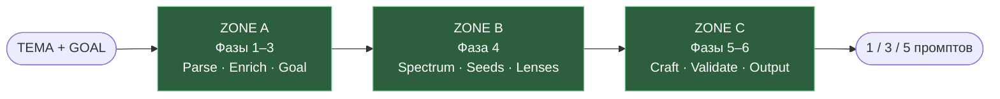

# UPG — Universal Prompt Generator

Система промпт-инжиниринга для text-to-image моделей. Берёт тему, возвращает откалиброванный спектр из 1, 3 или 5 исполнимых промптов с встроенными проверками безопасности, дрейфа и клише.


> 🇬🇧 [Read in English](README.md)

**Быстрые ссылки:** 🎯 [О проекте](#-что-это) · 🚀 [Запуск](#-как-пользоваться) · 🏛️ [Архитектура](docs/ARCHITECTURE.md) · 🧪 [Benchmark](BENCHMARK.md) · 📜 [CHANGELOG](CHANGELOG.md) · 📚 [Glossary](docs/GLOSSARY.md)

---

## 🎯 Что это?

**UPG** (Universal Prompt Generator) — это большой системный промпт, который вставляется в ChatGPT, Claude или другую модель с достаточным reasoning. На вход — тема (слово, фраза или заполненный шаблон). На выход — 1, 3 или 5 промптов, готовых к Midjourney, Flux, Stable Diffusion, xAI Aurora, Gemini Imagen или Firefly.

Чем UPG отличается от одноразового промпт-шаблона:

- **Шесть фаз пайплайна** с явными гейтами валидации на каждой границе.
- **Safety transform** — реальные люди, торговые марки, графическое насилие, хейт-спич переразмечаются ещё на Фазе 1.3, и замены пробрасываются во все последующие выходы.
- **Обогащение с учётом ширины темы** — широкие темы-зонтики ("эко-упаковка", "любовь") никогда не сужаются до одной идеологии; конкретные варианты выносятся в отдельные ветки как Specialized Variants.
- **Контроль дрейфа через EIS** — эмоциональная интенсивность каждого слота измеряется по шкале 0–100 и держится в заданных допусках от оригинальной темы.
- **BAN REGISTRY** — канонический список запрещённых прилагательных (`soft`, `subtle`, `elegant`), абстрактных существительных (`essence`, `harmony`) и финальных паттернов, которые размывают любой промпт в стоковую кашу.
- **Система слотов S1–S5** — у каждого слота своя роль (якорь / контраст / смежный / косвенный / отсутствие), Ring Test не даёт S4 скатиться обратно к S1.
- **Восемь Creative Lenses** — PHOTO, CINE, TEXTURAL, PAINT, ENV, SYMBOLIC, MINIMAL, SENSORY — с проверкой совместимости по aspect ratio и видимости объекта.

Текущая версия — **v10**, занимает около 30 KB сжатой нотации. Самая ранняя задумка (v0) — 5-шаговый "разрушитель клише" на русском для коммерческих кампаний. Первый нумерованный релиз (v1.0) из марта 2026 — 11-шаговый генератор поздравительных открыток. Между v0 и v10 — 39 итераций и 23 патча.

---

## 📖 Зачем этот репозиторий существует

Это **персональный исследовательский архив**. Цель — не распространение, а документация. Каждая full-версия сохранена, чтобы можно было проследить, откуда взялись решения:

- Как появилась обработка "abstract-hard" тем? См. v5.4 → v6.0 → v7.2.
- Когда и зачем возник ZONE A/B/C? См. v7.2.
- Почему v9.15 настолько короче v9.14? См. переход на компрессию (BAN REGISTRY становится canonical).
- Какую проблему решает Ring Test? См. Checklist BLOCK F3.

Смотреть не фасад промпт-системы, а её код. В этом смысл.

---

## ⚙️ Пайплайн вкратце



**Фаза 1** — парсинг входа, классификация ширины темы, safety check, роутинг на SIMPLE (1 промпт) / STANDARD (3) / COMPLEX (5). **Фаза 2** — обогащение в границах, заданных шириной темы и intent-сигналом. **Фаза 3** — AUTO-GOAL, если пользователь не задал цель. **Фаза 4** — генерация спектра: сиды, назначение слотов, распределение линз, ротация entry-angle. **Фаза 5** — непосредственное написание текста промптов с активным ban registry. **Фаза 6** — проход валидационных слоёв L1–L9.2 перед выдачей.

---

## 📁 Что внутри репо

```
upg/
├── full_versions/     39 слепков — от v0-задумки до v10 (+ параллельная ветка v666)
├── patches/           23 инкрементных патча
├── project_tools/     Companion-протоколы: Checklist, Analysis, VCP, Tournament, Dashboard
├── tools/             Visual Correspondence Protocol + пример прогона
├── scripts/           build_vault.py — регенерит авторский Obsidian vault
├── docs/              ARCHITECTURE, USAGE, EVOLUTION, GLOSSARY
├── LICENSE            All rights reserved
├── CHANGELOG.md       Keep-a-Changelog, сгруппирован по major
└── README.md          ← английская версия
```

---

## 📜 Версии по эпохам

| Эпоха | Версии | Что изменилось |
|---|---|---|
| **0.x (задумка)** | v0 | 5-шаговый концепт на русском: _Анализ клише → Разрушение шаблона → Художественное ДНК → Структурированный промпт → Самооценка._ Уже есть слотовый вывод (`[Subject] [Environment] [Lighting]...`) и само-оценка по 6 критериям — прообразы слотов S1–S5 и EIS. Тема вшита в сам промпт (пример — "Spring Energy", спортодежда, коммерция). |
| **1.x** | v1.0 | 11-шаговый генератор русских поздравительных открыток. Слово "Universal" в названии — аспирация, не факт. |
| **2–3** | v2.0, v2.2, v2.3, v3.0, v3.3, v3.5 | Переход на английский. Настоящая универсальность. v3.x добавляет Associative Artifacts + scratchpad CoT. |
| **4–5** | v4.0 → v5.6 | Параллельная ветка Image Prompt Generator. v5.1 — это meta-critic / surgeon, а не генератор. v5.4 вводит INTENT_SIGNAL, флаг ABSTRACT-HARD, полную safety-таксономию с лок-пропагацией. |
| **6** | v6.0 → v6.6 | GLOBAL PRIORITY STACK, шкала EIS 0–100, 5-Gate Boundary, Pattern 3C для abstract-hard тем. |
| **7–8** | v7.2 → v8.9 | Рефакторинг в ZONE A/B/C. CONCISE_MODE по умолчанию. Восемь Creative Lenses стабилизируются. |
| **9** | v9.4 → v9.19.1 | Эпоха компрессии. v9.15 делает BAN REGISTRY canonical. v9.18 добавляет CAMERA_SYSTEM (таблицы объективов ARRI/RED/Sony/Hasselblad), THRESHOLD_ELEMENTS, REALISM_ANCHOR, REFERENCE_EXTRACTION. |
| **10** | v10 | Generator Trigger Registry, шесть locks (IDENTITY / LOCALE / STYLE / MATERIAL / AUTH / DEVICE_SIM), VALIDATION STACK L1–L9.2, HARD CHECKS P0–P1M. |
| **666** | v666.4.1, v666.5.2.1, v666.5.2.3 | Параллельный форк с накопленными правилами в отдельной линии развития. |

Подробнее — [CHANGELOG.md](CHANGELOG.md) по версиям и [docs/EVOLUTION.md](docs/EVOLUTION.md) про ветвление (это не линейная цепочка).

---

## 🛠️ Companion-инструменты

UPG — это движок. Вокруг него — протоколы-спутники.

| Инструмент | Версия | Что делает |
|---|---|---|
| **Checklist** | v1.8.0 | Interview-first спецификация для составления темы. Запускается в отдельной сессии, выдаёт THEME TEMPLATE, который UPG v9.15+ принимает как STRUCTURED THEME INPUT. 21 блок, 80 параметров, маркеры критичности. |
| **Analysis Prompt** | v1.1 | 10-этапный протокол пост-run анализа. Классифицирует compression artifacts, drift, unauthorized injection. |
| **Audit Analysis** | v1.2 | Второй проход-аудит для routing и safety integrity. |
| **Analysis Report** | v2.1 | Структурированный формат вывода для пайплайна анализа. |
| **Visual Correspondence Protocol (VCP)** | v1.0 | 6-этапный аудит image ↔ prompt. Оценивает fidelity, ловит пропавшие элементы, флагает несанкционированные добавки. |
| **Session Dashboard** | v1.0 | 9-блочный summary сессии для хэндоффа между чатами. |
| **Tournament** | v2 | Сравнительный рейтинг вариантов промптов. |

Всё лежит в [`project_tools/`](project_tools/) и [`tools/`](tools/).

---

## 🧪 Тестирование и benchmark

UPG прогонялся через валидационную кампанию: **32 теста на 18 LLM-моделях** (OpenAI, Anthropic, Google, Zhipu, Moonshot, Baidu, Alibaba, xAI, DeepSeek). Полный отчёт — [BENCHMARK.md](BENCHMARK.md).

**Топ по стабильности (best of 29/29):**

| Место | Модель | Счёт | Tier |
|---|---|---|---|
| 🥇 | 🐸 GPT-5.4 / 5.2 | 29/29 | S+ Premium |
| 🥈 | 🇨🇳 GLM-5 | 28/29 | S Premium |
| 🥉 | 🦊 Sonnet-4.5 | 27.5/29 | A+ High |
| — | 🦚 Gemini-3.1 | 28.5/29 | S+ Premium |

Для моделей со склонностью к отклонениям (Claude-линейка, DeepSeek, Grok, ERNIE, Qwen) разработаны базовые обёртки-компенсаторы. GPT-5.4 / 5.2 / Gemini-3.1 / GLM-5 работают без обёрток.

Аудит кампании v12.1 выявил две слепые зоны валидации (L7 density counting, L7.5 lens-aspect compat), закрытые в патче v9.22 и унаследованные v10.

---

## 🚀 Как пользоваться

Подробно — в [docs/USAGE.md](docs/USAGE.md). Коротко:

1. Открыть [full_versions/UPG_v10.md](full_versions/UPG_v10.md). Скопировать весь файл.
2. Вставить как system prompt (Claude Projects) или как первое сообщение (Custom GPT в ChatGPT или просто в чате).
3. Дать тему. Минимум: `THEME: красные кроссовки под дождём`. Если параллельно прогонял Checklist, вставить сгенерированный блок STRUCTURED THEME INPUT.
4. Прочитать выдачу, скопировать любой из 1/3/5 промптов в image-модель.

Более глубокие сценарии — Checklist → UPG handoff, ранжирование через Tournament, аудит через Visual Correspondence — см. USAGE.

---

## 🏛️ Архитектура

30-минутный разбор устройства системы — [docs/ARCHITECTURE.md](docs/ARCHITECTURE.md). Там фазы, зоны, сиды, модули, ban registry, и зачем существует каждый слой валидации.

По терминам (EIS, Drift, Ring Test, Carrying Image, Lens, Zone, Slot) — [docs/GLOSSARY.md](docs/GLOSSARY.md).

---

## 📊 Статус

Active research. Нумерация авторская (SemVer не гарантируется). Патчи могут ломать структуру фаз. v10 — текущий стабильный референс; более ранние версии хранятся для трассируемости и не поддерживаются.

---

## 🔒 Лицензия

**All Rights Reserved.** Полный текст — [LICENSE](LICENSE).

Это не open-source. Читать можно. Использовать в своих проектах, коммерческих или нет, без явного письменного разрешения — нельзя. Запросы — через GitHub-профиль автора.

---

## ✍️ Автор

[**@404stillhere**](https://github.com/404stillhere) — промпт-инжиниринг, архитектура, проектные решения.
