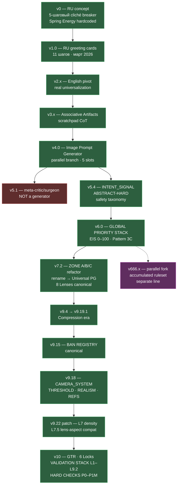

# EVOLUTION

Это история того, как v0 превратился в v10. История не линейная: были развилки, был параллельный форк (v666), один релиз (v5.1) вообще не был генератором, имя "Universal" пришло к системе намного позже, чем появилось в её названии.

Если тебе нужен хронологический список версий с тегами — это [CHANGELOG.md](../CHANGELOG.md). Этот файл отвечает на другой вопрос: **почему** в каждой точке разработки система сделала этот конкретный шаг.

---

## Ветвление на одной схеме



---

## Эпоха 0 — задумка

**v0** ([UPG_v0.md](../full_versions/UPG_v0.md)) — русский 5-шаговый промпт для разрушения клише в коммерческих визуалах. Тема вшита прямо в тело системы: "спортивная одежда бренда Spring Energy", цель — коммерция, эмоция — "веет энергией, заряжает".

Что уже есть:
- **Слотированный вывод**: `[Subject] [Environment] [Lighting] [Composition] [Camera / Lens] [Textures] [Color palette] [Mood] [Artistic references] [Technical tags] [Aspect ratio]` — это прямой предок S1–S5.
- **Само-оценка по 6 критериям** (новизна, визуальная сила, художественная глубина, запоминаемость, коммерческий потенциал, риск клишированности) — предок EIS 0–100.
- **Правило переписывания**: если новизна < 8 ИЛИ визуальная сила < 8 ИЛИ риск клише > 5 → переписать концепт полностью, максимум 3 цикла. Это механика раннего drift control.
- **Разрушение шаблона через парадокс**: "смешай несовместимые стили, создай визуальный конфликт" — прото-версия того, что потом станет Ring Test для S4.

Чего ещё нет: никакой safety-логики, никаких Modules, никакого multi-prompt спектра (выход — один промпт, не пять), никакого INTENT_SIGNAL. Тема жёстко hardcoded.

Термин **"художественное ДНК"** из ШАГА 3 исчезнет в следующих версиях — концепция усиления через "гипердетализированный элемент + минималистичный контраст + скрытый символ" не переживёт перехода на английский.

---

## Эпоха 1 — первое название, первый релиз

**v1.0** ([UPG_v1_0.md](../full_versions/UPG_v1_0.md), март 2026) — русский 11-шаговый генератор. Название: **"GREETING CARD PROMPT GENERATOR v1.0"** 🃏. Это не generic-генератор, это узкоспециализированный инструмент для поздравительных открыток. Слово "Universal" в последующем названии системы — это аспирация, не факт на этом этапе.

Ключевое добавление — **"АССОЦИАТИВНЫЙ ДВИЖОК"**: Фаза A (6 прямых ассоциаций), Фаза B (мутация через 5 линз: ИНВЕРСИЯ / ЭМОЦИЯ / МЕТАФОРА / МАСШТАБ / ВРЕМЯ), Фаза C (турнир мутаций по 3 критериям). Это прямой предок Associative Artifacts из v3.x и всей концепции Entry Angles.

---

## Эпоха 2–3 — английский и настоящая универсальность

**v2.0 → v3.5** — переход на английский. Вместе с языком меняется и рамка: система перестаёт быть привязана к открыткам и становится generic prompt generator.

**v3.x** добавляет:
- **Associative Artifacts** — формализованный выход ассоциативного движка в виде структурированного блока, который используется следующими фазами, а не просто "подумали и забыли".
- **Scratchpad CoT** — модель явно пишет свой reasoning в отдельном блоке перед финальным выводом. Это увеличивает прозрачность пайплайна.

На этом этапе система ещё выдаёт 1 промпт, не 5.

---

## Эпоха 4–5 — параллельная ветка и безопасность

### v4.0 — Image Prompt Generator (переименование)

[UPG_v4_0.md](../full_versions/UPG_v4_0.md) выходит под названием **"IMAGE PROMPT GENERATOR v4.0"** — это уже не "Universal", это "Image". Ключевое изменение — **5 финальных промптов на выход** вместо одного. Здесь начинается многослотовая парадигма, из которой позже вырастут S1–S5 как осмысленные роли, а не просто "5 вариантов одной темы".

### v5.1 — тупиковая ветвь (это не генератор)

[UPG_v5_1.md](../full_versions/UPG_v5_1.md) — **"meta-critic and surgeon"**. Это не генератор, а хирургический инструмент: на вход ему подаётся результат работы v5.0, он детектит 4 систематические ошибки:
1. Escalation bias (неоправданный COMPLEX routing)
2. Creative overreach (narrowing + идеологическая инъекция на стадии enrichment)
3. Self-validation bias (слишком мягкий drift/EIS check)
4. Theory–practice gap (слишком поэтические, неисполнимые промпты)

v5.1 больше не развивается как отдельная ветка, но уроки, которые он выявил, прямо вшиваются в v5.4 как structural rules. Это первый пример рефлексивной разработки: **система, которая диагностирует сама себя, превращается в встроенную валидацию следующего поколения**.

Всё, что нашёл v5.1, позже становится частью VALIDATION STACK L1–L9.2 в v10.

### v5.4 — переломная точка

[UPG_v5_4.md](../full_versions/UPG_v5_4.md) вводит три вещи, которые останутся до v10:

- **INTENT_SIGNAL** (LITERAL / EXPANSIVE / COMPLEXITY / DEFAULT) — сигнал, который читается из формулировки темы и задаёт границы enrichment. "Красные кроссовки" — LITERAL, сужаем. "Цвет настроения" — EXPANSIVE, расширяем. "Комплексная тема о свободе воли и детерминизме" — COMPLEXITY, пять слотов с разными углами.
- **ABSTRACT-HARD flag** — маркер для тем, которые невозможно визуализировать напрямую (любовь, свобода, одиночество, время). Позже это станет Pattern 3C.
- **Полная safety-таксономия с propagation lock** — реальные люди, брендированное IP, graphic violence, hate speech переразмечаются в Phase 1.3, и замены прокидываются во ВСЕ последующие фазы с блокировкой отката. До v5.4 safety был опциональным; с v5.4 — обязательным и неотключаемым.

---

## Эпоха 6 — измеримость

**v6.0 → v6.6** — эра количественных метрик.

- **GLOBAL PRIORITY STACK** — явная иерархия: Policy → GOAL → CONSTRAINTS → Context → AUTO-GOAL. Раньше эти приоритеты были неявные, модель сама решала. Теперь — явно зафиксированы.
- **EIS 0–100 scale** — эмоциональная интенсивность теперь численная. У каждого слота есть EIS, дрейф между S1 и S4 считается как абсолютная разность с допуском.
- **5-Gate Boundary** — 5 валидационных гейтов на границах фаз (не все сразу в v6.0, часть добавляется к v6.6). Прообраз VALIDATION STACK.
- **Pattern 3C для abstract-hard** — абстрактная тема никогда не визуализируется напрямую. Вместо "изобрази любовь" — строится carrier scene, из которой тема считывается. Это одно из ключевых архитектурных решений: **UPG принципиально отказывается делать то, что не знает, как сделать правильно**, и вместо этого перекладывает ответственность на carrier.

---

## Эпоха 7–8 — архитектурный рефакторинг

**v7.2** ([UPG_v7_2.md](../full_versions/UPG_v7_2.md)) — финальное переименование в **"UNIVERSAL PROMPT GENERATOR v7.2"** и крупнейший refactor со времён v4.0.

- **ZONE A / ZONE B / ZONE C** — фазы 1–6 группируются в три зоны: A (parse/enrich/goal), B (spectrum/seeds/lenses), C (craft/validate/output). Это не косметика: каждая зона имеет чёткие входы, выходы и валидационные гейты на границах. Система становится отлаживаемой — если сломалось в ZONE B, ты знаешь, что parse и enrich уже прошли.
- **CONCISE_MODE by default** — раньше пайплайн печатал полный diagnostic template. Теперь по умолчанию молчит, печатает только Routing Summary и промпты. Это -60% текста в выдаче.
- **8 Creative Lenses канонизируются**: PHOTO, CINE, TEXTURAL, PAINT, ENV, SYMBOLIC, MINIMAL, SENSORY. До v7.2 набор линз плавал от версии к версии.

**v8.0 → v8.9** — итеративная стабилизация. Lenses получают compatibility checks с aspect ratio и subject visibility. Arc Planning добавляет ротацию Entry Angles (A/B/C/D).

---

## Эпоха 9 — компрессия

**v9.4 → v9.19.1** — философия "меньше текста, больше контроля".

- **v9.15 — BAN REGISTRY становится canonical**. До v9.15 список запрещённых слов был распределён по телу системы в десятках мест. В v9.15 он собран в единый блок: Tier 1 adjectives (soft/subtle/elegant → replace materially), Tier 2, banned abstract nouns (stillness/silence/essence), banned final patterns, camera-as-agent ban. **Это резкое сокращение объёма** — v9.15 на 25% короче v9.14 при большей покрываемой функциональности.
- **v9.18** добавляет целый блок продвинутых модулей:
  - **CAMERA_SYSTEM** — таблицы реальных объективов: ARRI Alexa 35 + Zeiss Master Primes, RED V-Raptor + Cooke S7/i, Sony Venice + Leica Summilux-C, Hasselblad + HC line, Panavision Primo.
  - **THRESHOLD_ELEMENTS** — механизм для частично видимых элементов: GHOST (едва различимо), HINT (намёк), PARTIAL (частично видно), OBSCURED (скрыто, но читается). Через FOG/BOKEH/SHADOW/REFL/PERIPH/OVER/UNDER/MOTION/TRANS.
  - **REALISM_ANCHOR** — якорь реализма, активируется в MODE 3 / Supernatural / Fantasy.
  - **REFERENCE_EXTRACTION** — таблица авторов с техническими характеристиками (Lubezki / Deakins / Crewdson / Vermeer / Tarkovsky / Hopper / Hitchcock / Wong Kar-wai / Beksiński / BR2049).

### Патч v9.22 — закрытие blind spots

Аудит валидационной кампании v12.1 (18 моделей, 32 теста, документированы в [BENCHMARK.md](../BENCHMARK.md)) выявил две дыры:

- **L7 density counting** — валидатор считал плотность элементов в одном промпте нестрого: один материал с определением засчитывался и как material, и как texture, раздувая counts. Патч вводит правило "каждое слово/фраза считается ровно в одну категорию".
- **L7.5 lens-aspect compatibility** — CINE lens + квадратный аспект, TEXTURAL lens + face as subject, FULL SCENE scale + длинный focal — эти несовместимости не ловились. Патч добавляет явную матрицу совместимости.

v9.22 не лежит в репозитории как отдельный full-файл. Его содержимое унаследовано v10 — см. CHANGELOG.

---

## Эпоха 10 — production

**v10** ([UPG_v10.md](../full_versions/UPG_v10.md)) — текущий стабильный референс. Добавления:

- **Generator Trigger Registry (GTR)** — реестр триггеров под конкретные генераторы: Quality Boosters (что повышает качество на этой платформе), Aesthetic Magnets (слова, к которым платформа тяготеет и интерпретирует сильно), Composition Overrides (что работает вопреки дефолтам платформы), Platform-Specific Traps (чего нельзя писать — уведёт в стоковую кашу).
- **6 Locks** — IDENTITY (сохранение признаков персонажа через слоты), LOCALE (геокультурные маркеры), STYLE (привязка к named style profile), MATERIAL (micro-texture fidelity), AUTH (фото-аутентичность: флэр, grain, motion blur, off-center framing), DEVICE_SIM (симуляция конкретного устройства: iPhone / GoPro / Polaroid / Disposable / DSLR consumer / Webcam).
- **VALIDATION STACK L1–L9.2** — 9+ слоёв валидации с явными пороговыми значениями. Каждый слой имеет input, метрику, порог, действие.
- **HARD CHECKS P0–P1M** — бинарные проверки, которые либо проходят, либо всё возвращается на пересборку. P0 — safety. P1A — carrying image fidelity. P1B — arc coherence. P1M — material fidelity.

**v10 — это v9.22 + реестр платформ + система локов + формализация валидации.** Концептуально новых механик мало; главное отличие — это production-grade документация того, что в v9.x было распределено по тексту.

---

## Параллельный форк — v666

[UPG_v666_4_1.md](../full_versions/UPG_v666_4_1.md), [UPG_v666_5_2_1.md](../full_versions/UPG_v666_5_2_1.md), [UPG_v666_5_2_3.md](../full_versions/UPG_v666_5_2_3.md) — это **не joke-релизы**. Это параллельная линия развития, начатая примерно с момента v6.x, в которой накапливались правила в отдельном порядке. Структурно v666.4.1 очень близка к v6.6 / v7.x (то же SYSTEM ROLE, те же INPUTS), но эволюционирует по другой траектории.

Ветка помечена префиксом v666 именно для того, чтобы visually её не путать с основной линией. На мейн-линию она не сливалась, своих инструментов-спутников не имеет, тестировалась отдельно. Сохраняется в репозитории для полноты истории и потому, что некоторые формулировки в main-линии v10 пришли именно отсюда.

---

## Что умирало по дороге

Несколько концепций появились и исчезли:

- **"Художественное ДНК"** (v0, Шаг 3: "усиление через гипердетализированный элемент + минималистичный контраст + скрытый символ"). Концепция-предок идеи слотов с разными ролями, но сам термин и конкретика не переносятся ни во что напрямую. Исчезает с переходом на английский.
- **"АССОЦИАТИВНЫЙ ДВИЖОК" как отдельная Фаза 0** (v1.0) — превращается в Associative Artifacts в v3.x, потом растворяется в Entry Angle System (v7.2+).
- **MODE 2 (narrative arc)** — присутствует в v7.2–v9.x, упоминается в v10 как `MODE 1 (default) / MODE 3 (remix/permutation)`, но MODE 2 исчезает из дефолтного набора. Narrative arc теперь имплицитный через SHALLOW ARC + Entry Angle rotation.
- **6 шкал само-оценки v0** (новизна / визуальная сила / художественная глубина / запоминаемость / коммерческий потенциал / риск клишированности) — превращаются в EIS в v6.0, который потом обрастает Drift metrics.

---

## Что осталось с v0

Удивительное: прото-список слотов **остаётся практически нетронутым** от v0 до v10.

v0 (Шаг 4):
```
[Subject] [Environment] [Lighting] [Composition]
[Camera / Lens] [Textures] [Color palette] [Mood]
[Artistic references] [Technical tags] [Aspect ratio]
```

v10 Carrying Image (10 компонентов): 7 физических + 3 поведенческих — это тот же список, просто переупакованный в явную модель с валидацией и порогом ≥7/10.

**Идея "промпт = структурированный слот-блок, а не свободная поэзия"** — это единственное, что пришло из v0 и дожило до v10 без изменений.

---

## Смотри также

- [CHANGELOG.md](../CHANGELOG.md) — пофайловая хронология с датами и ссылками на патчи
- [ARCHITECTURE.md](ARCHITECTURE.md) — как устроен финальный v10 изнутри
- [BENCHMARK.md](../BENCHMARK.md) — почему v9.22 и v10 появились именно в этот момент (аудит кампании v12.1)
- [GLOSSARY.md](GLOSSARY.md) — термины, некоторые из которых меняли значение между версиями
